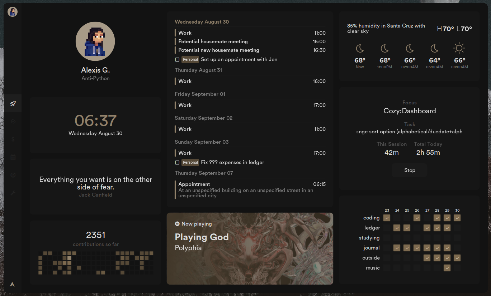
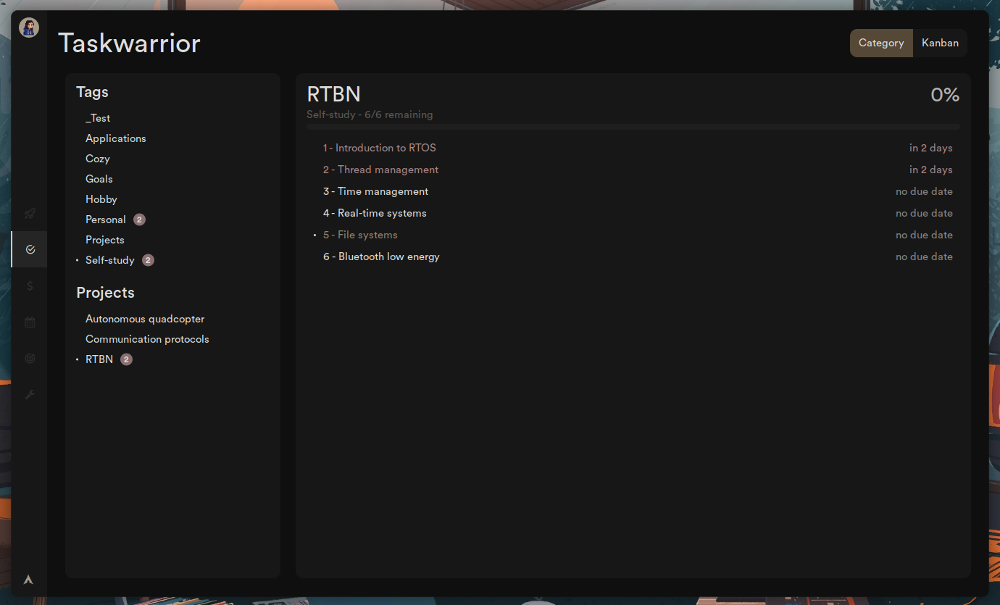
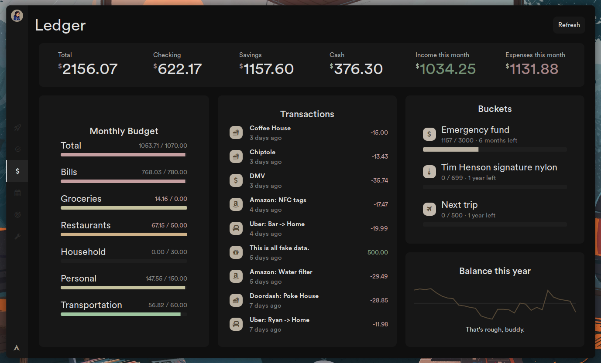
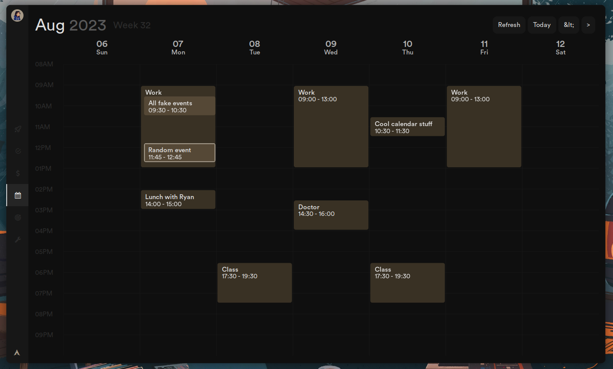
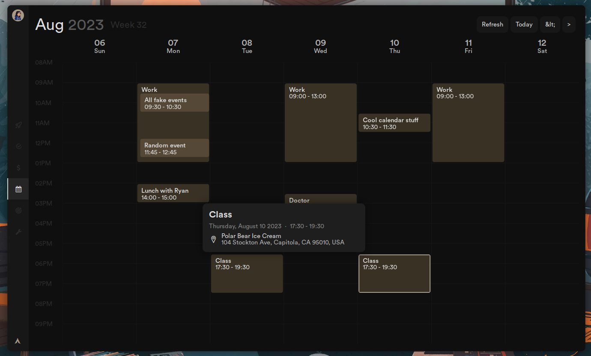
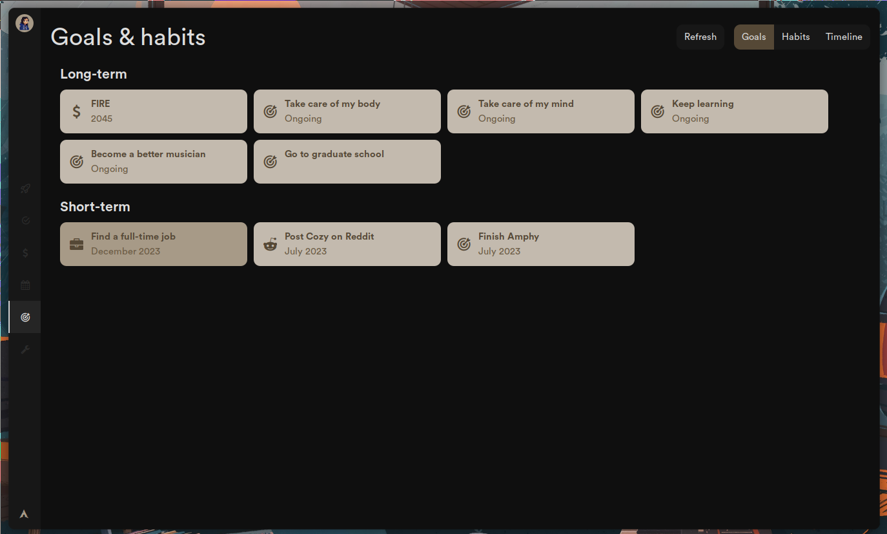
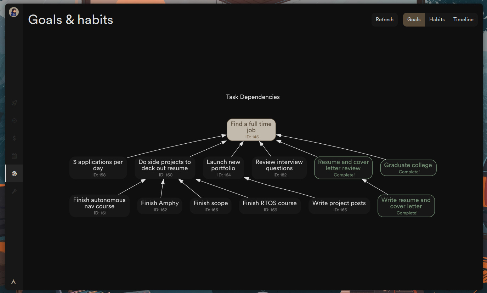

<h1 align="center">Cozy</h1>

Hi! This is Cozy, my AwesomeWM config. Its focus is creating widgets that increase efficiency and productivity by
integrating various command-line programs like gcalcli, Taskwarrior, Timewarrior, Ledger, and more. Thanks for checking
it out!

⚠️ I'm rewriting this from scratch and this is under really heavy development. This code probably won't work on your machine. Clone at your own risk. ⚠️

<!-- █▀▄ ▄▀█ █▀ █░█ █▄▄ █▀█ ▄▀█ █▀█ █▀▄ -->
<!-- █▄▀ █▀█ ▄█ █▀█ █▄█ █▄█ █▀█ █▀▄ █▄▀ --> 

<h1> Dashboard </h1>

<h2> Main tab </h2>

All the essentials.

<ul>
  <li>View upcoming tasks and events using Taskwarrior + gcalcli</li>
  <li>Track habits with <a href="https://pixe.la">Pixela</a></li>
  <li><a href="https://github.com/GothenburgBitFactory/timewarrior">Timewarrior</a> time-tracking</li>
  <li>And more fun widgets!</li>
</ul>

<h2> Task management </h2>

Simple, aesthetic, and easy-to-use GUI for Taskwarrior.

<h2> Ledger </h2>

Use data from <a href="https://github.com/ledger/ledger">ledger-cli</a> to view your budget progress, recent transactions, and yearly balance trends.

<h2> Calendar </h2>

Your schedule at a glance. Powered by gcalcli.

Calendar keybinds

| Keybind          | Action           |
| -------          | ------           |
| <kbd>H</kbd>     | Previous week    |
| <kbd>L</kbd>     | Next week        |
| <kbd>J</kbd>     | Scroll down      |
| <kbd>K</kbd>     | Scroll up        |
| <kbd>gg</kbd>    | Scroll to top    |
| <kbd>GG</kbd>    | Scroll to bottom |
| <kbd>zz</kbd>    | Center           |
| <kbd>h/k</kbd>   | Previous event   |
| <kbd>j/l</kbd>   | Next event       |
| <kbd>t</kbd>     | Jump to today    |
| <kbd>r</kbd>     | Refresh          |

<h2> Goal tracking </h2>

Goal visualization and tracking with Taskwarrior, GraphViz, and twdeps.

<!-- █▀█ ▀█▀ █░█ █▀▀ █▀█ -->
<!-- █▄█ ░█░ █▀█ ██▄ █▀▄ -->

<h1> Theme switcher </h1>

The theme switcher seamlessly matches Cozy's colorscheme with the rest of your system.

<!-- █▀▀ █▀█ █▀█ ▀█▀ █▄░█ █▀█ ▀█▀ █▀▀ █▀ --> 
<!-- █▀░ █▄█ █▄█ ░█░ █░▀█ █▄█ ░█░ ██▄ ▄█ --> 

<h3>Other stuff</h3>
<b>Why is it called 'cozy'?</b>

I've spent a lot of time tweaking this setup to be just the way I like it, so now this setup feels very personal, comfortable, and cozy. :-)

<b>Why write this with Awesome and not a "proper" UI framework?</b>

I started out making simple things like a fancy bar and then over the course of a year it slowly but steadily turned into whatever this is. I'm in too deep, I fear. Also, Awesome is unbelievably easy to use and development with it is really, really fast, and since this is just a hobby and this stuff has nothing to do with my career skillset, starting over with a different framework would be a waste of time.

<h3>Credits</h3>
<ul>
  <li><a href="https://github.com/rxyhn/yoru" target="_blank">rxyhn</a> jumpstarted my interest in AwesomeWM and I was only able to get this far thanks to studying his dotfiles.
  </li>

  <li>
    <a href="https://github.com/Kasper24/KwesomeDE" target="_blank">kasper24</a>'s very epic config helped guide me while writing backend stuff for dashboard.
  </li>

  <li>
    <a href="https://github.com/Aspectsides/dotfiles" target="_blank">Aspectsides</a> for excellent taste in wallpapers (Mountain).
  </li>
</ul>
