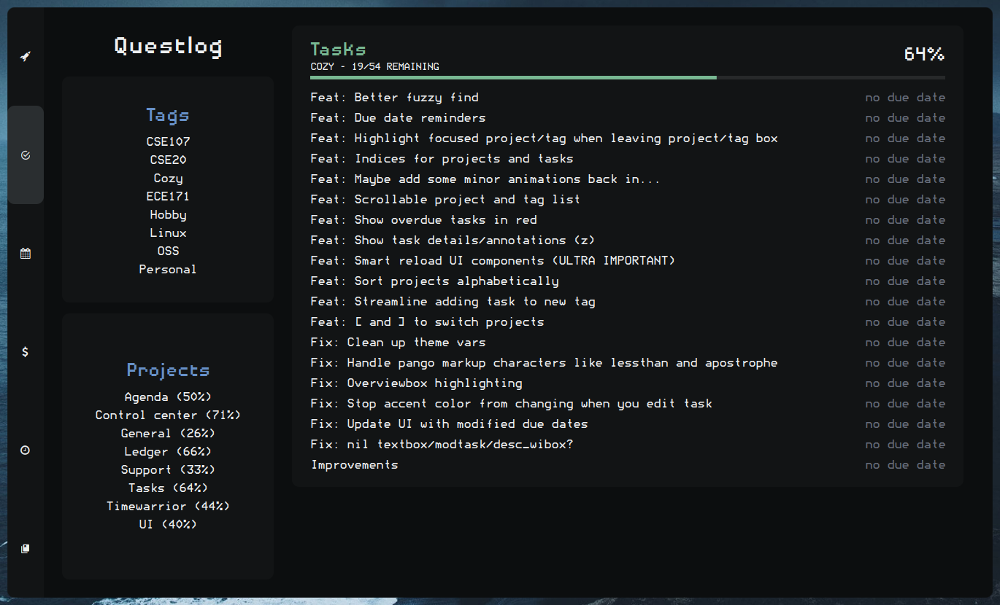
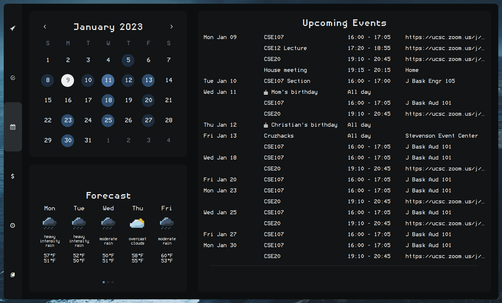
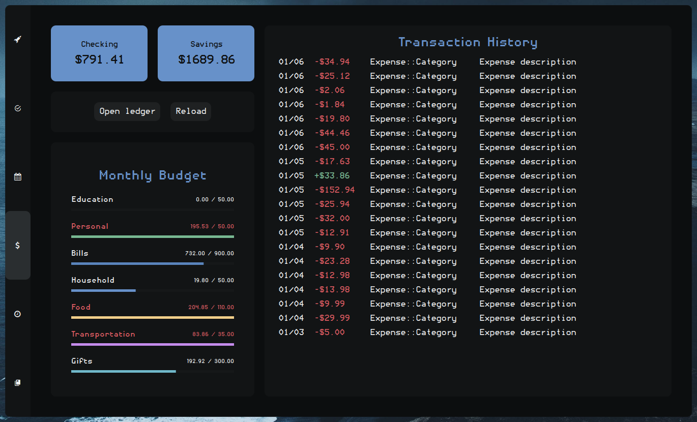
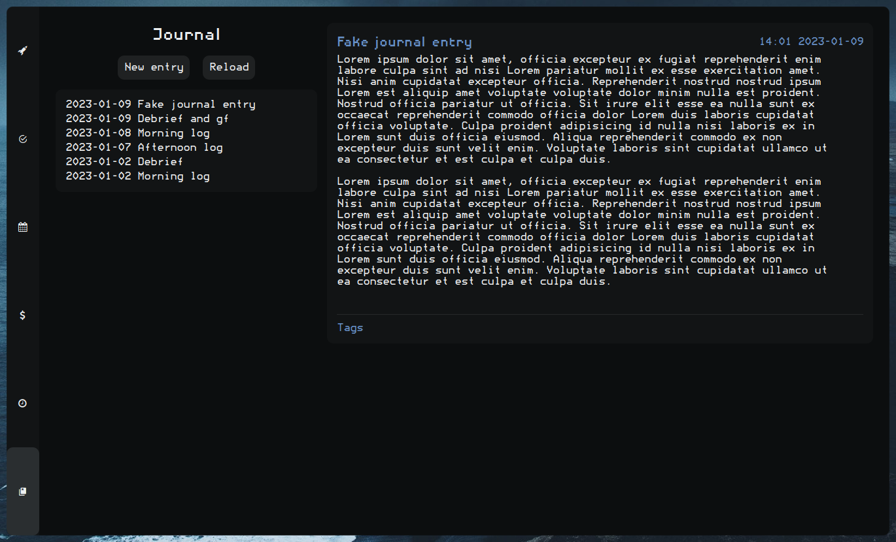
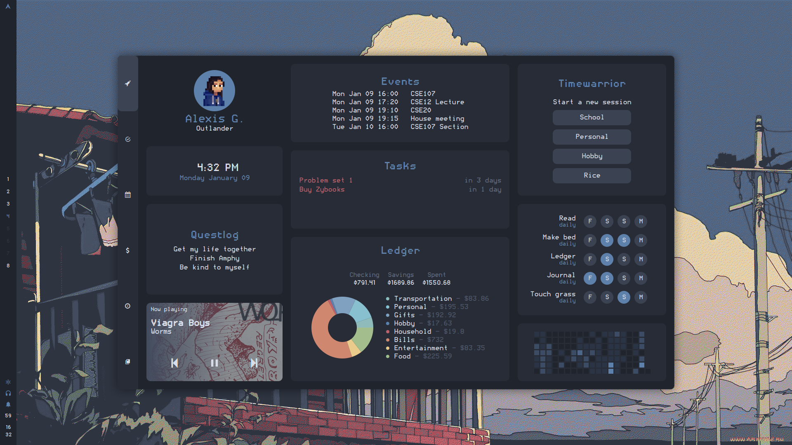
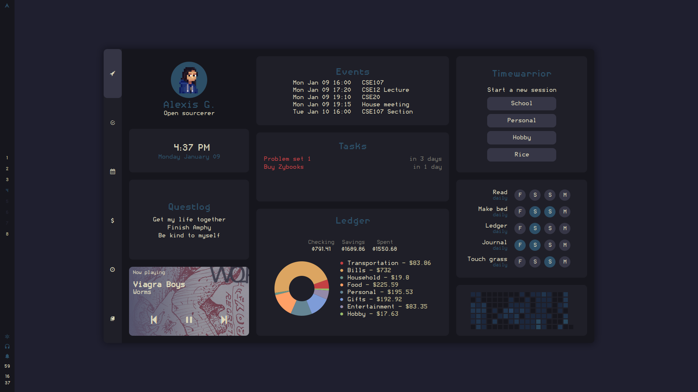
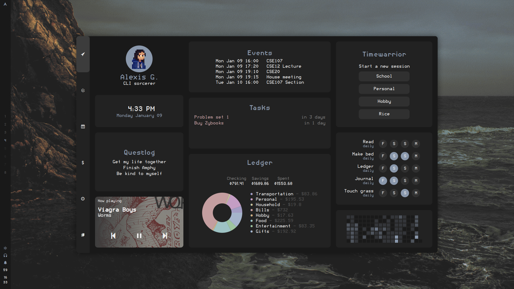
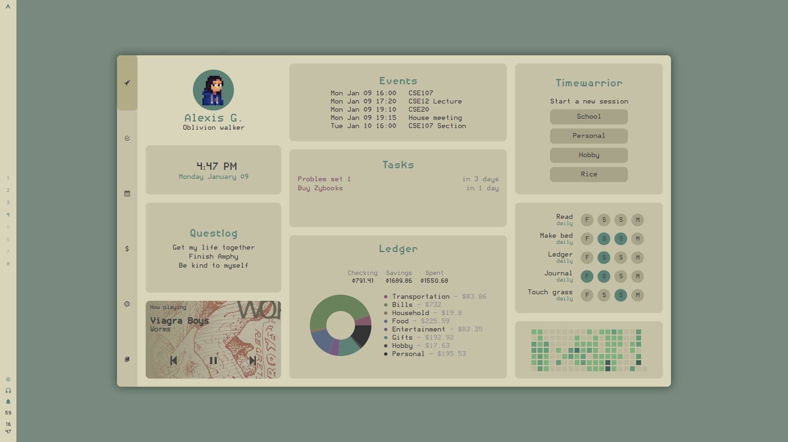

<h1 align="center">Cozy</h1>

  

 Hi! This is <b>Cozy</b>, my AwesomeWM config. 

<!-- █▀▄ ▄▀█ █▀ █░█ █▄▄ █▀█ ▄▀█ █▀█ █▀▄ -->
<!-- █▄▀ █▀█ ▄█ █▀█ █▄█ █▄█ █▀█ █▀▄ █▄▀ -->

<h2>Dashboard</h2>

  I love the terminal, but I love a good UI even more. The dashboard is a collection of graphical interfaces for several command-line applications, including <a href="https://github.com/ledger/" target="_blank">ledger</a>, <a href="https://taskwarrior.org/" target="_blank">taskwarrior</a>, <a href="https://timewarrior.net" target="_blank">timewarrior</a>, and <a href="https://github.com/insanum/gcalcli" target="_blank">gcalcli</a>.

  The dashboard (as well as every other popup) is fully keyboard navigable with Vim-like keybinds using a custom navigation library.

<h4>Main tab</h4>

  

<ul>
  <li>Habit-tracking with <a href="https://pixe.la">Pixela</a></li>
  <li>Github contributions widget <a href="https://github.com/streetturtle/awesome-wm-widgets/blob/master/github-contributions-widget/README.md">(streetturtle)</a></li>
  <li>View current Timewarrior time-tracking</li>
</ul>

<h4>Task management</h4>

  

<ul>
  <li>Aesthetic and easy-to-use GUI for Taskwarrior</li>
  <li>Add, view, and edit tasks from dashboard</li>
  <li>Start and stop tasks for easy time-tracking</li>
</ul>

<h4>Google Calendar</h4>

  

<ul>
  <li>Add, view, and edit Google Calendar events</li>
  <li>Open meeting links directly from dashboard</li>
  <li>Calendar with heatmap showing which days are busiest</li>
</ul>

<h4>Ledger</h4>

  

<ul>
  <li>View budget and spending details at a glance</li>
  <li>The convenience of a banking app without relying on a shady 3rd party</li>
  <li>Quickly access ledger files to add or update ledger entries</li>
</ul>

<h4>Journal</h4>

  

<ul>
  <li>View past journal entries and quickly create new ones (idk, I like to reread them a lot)</li>
</ul>

<!-- █▀▀ █▀█ █▄░█ ▀█▀ █▀█ █▀█ █░░    █▀▀ █▀▀ █▄░█ ▀█▀ █▀▀ █▀█ --> 
<!-- █▄▄ █▄█ █░▀█ ░█░ █▀▄ █▄█ █▄▄    █▄▄ ██▄ █░▀█ ░█░ ██▄ █▀▄ --> 

<h2>Control center</h2>

  Fancy little thing.

<!-- ▀█▀ █░█ █▀▀ █▀▄▀█ █▀▀    █▀ █░█░█ █ ▀█▀ █▀▀ █░█ █▀▀ █▀█ -->
<!-- ░█░ █▀█ ██▄ █░▀░█ ██▄    ▄█ ▀▄▀▄▀ █ ░█░ █▄▄ █▀█ ██▄ █▀▄ -->

<h2>Theme switcher</h2>

  Changes NvChad and Kitty themes, as well as AwesomeWM theme.

Theme preview

  

    
  

  

    
  

  

    
  

  

    
  

  

    
  

<!-- █▀▀ █▀█ █▀█ ▀█▀ █▄░█ █▀█ ▀█▀ █▀▀ █▀ --> 
<!-- █▀░ █▄█ █▄█ ░█░ █░▀█ █▄█ ░█░ ██▄ ▄█ --> 

<h3>Other stuff</h3>
<b>Why is it called 'cozy'?</b> 
I've spent a lot of time tweaking this setup to be just the way I like it, so now this setup feels very personal, comfortable, and cozy.  :-)

<h3>Credits</h3>
<ul>
<li><a href="https://github.com/rxyhn/yoru" target="_blank">rxyhn</a> for code reference
<li><a href="https://github.com/adi1090x/rofi" target="_blank">adi1090x</a> for rofi theme
<li><a href="https://github.com/siddhanthrathod/bspwm" target="_blank">siddhanthrathod</a> for picom configuration
<li><a href="https://github.com/nickclyde/rofi-bluetooth" target="_blank">nick clyde</a> for rofi-bluetooth
</ul>
