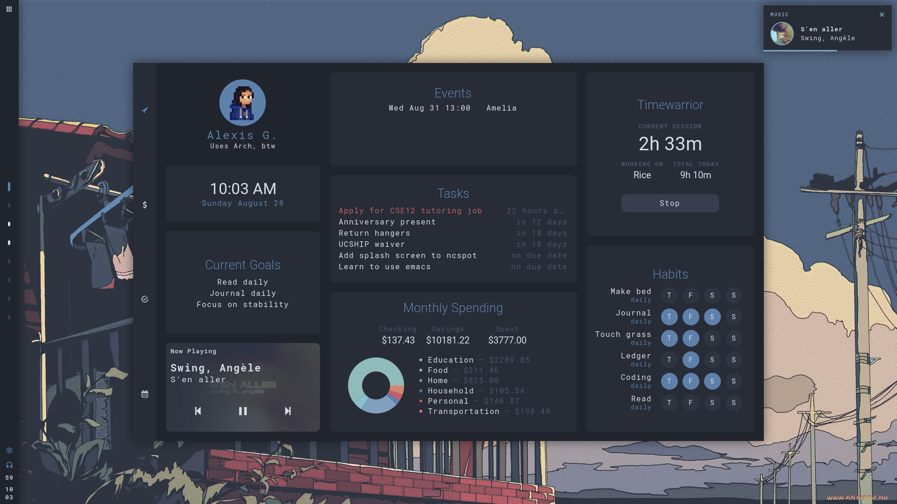
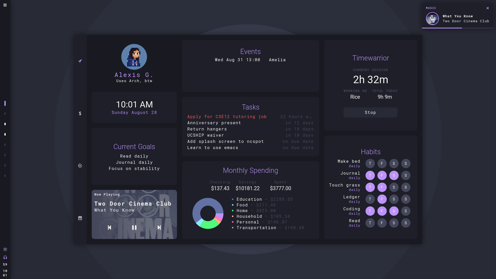
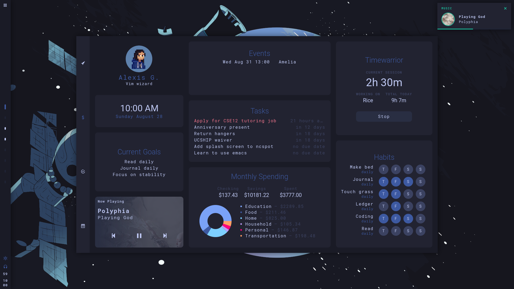

<h1 align="center">cozy</h1>

  

Hi! This is <b>cozy</b>, my <a href="https://awesomewm.org" target="_blank">AwesomeWM</a> config. Thanks for checking it out!

  The primary goals of this setup are to create an environment that:

<ol>
<li>can be used easily on both my laptop and my touchscreen tablet</li>
<li>integrates all the cli tools I use to manage my life into a nice dashboard</li>
<li>looks awesome!</li>
</ol>

This is a port of my old Eww config. I've decided to keep maintaining the Eww config <a href="https://github.com/garado/cozy/tree/eww" target="_blank">here</a> because I might leave Awesome one day. (Eww version is heavily wip and won't be updated as often)

<h2>🚀 Dashboard</h2>

  

<b>Features</b>
<ul>
<li>Fancy music player (thank you <a href="https://github.com/rxyhn/yoru" target="_blank">rxhyn</a>)</li>
<li>Calendar (with Google Calendar) </li>
<li>To do list (with <a href="https://taskwarrior.org/" target="_blank">Taskwarrior</a>)</li>
<li>Time tracking (with <a href="https://timewarrior.net" target="_blank">Timewarrior</a>)</li>
<li>Interactive habit tracker (with <a href="https://pixe.la" target="_blank">Pixela</a>)</li>
<li>Fancy finances (with <a href="https://github.com/ledger/" target="_blank">Ledger</a>)</li>
<li>(WIP) Different tabs to show even more information!</li>
</ul>

<h2>🔧 Install and configure</h2>
<b>NOTE: This setup is incomplete, somewhat buggy, and under constant development.</b> Because of that, I don't recommend daily driving it quite yet.

<b>Install</b>

Install dependencies (Arch/Arch-based)

<pre><code>yay -S awesome-git gcalcli nerd-fonts-roboto-mono ttf-roboto picom-pijulius-git
pacman -S playerctl rofi scrot pamixer brightnessctl upower task timew ledger mpg123
</code></pre>

Clone repository

<code>git clone --recurse-submodules https://github.com/garado/cozy.git</code>

(Optional) Make a backup of your old configs

<pre><code>cp -r ~/.config/awesome/ ~/.config/awesome.${USER}/
cp -r ~/.config/rofi/ ~/.config/rofi.${USER}/
cp ~/.config/picom.conf ~/.config/picom.${USER}.conf</code></pre>

Copy configs

<code>cd cozy && cp -r awesome/ rofi/ picom.conf ~/.config/</code>

Copy <code>misc/on-add-update-dash</code> and <code>misc/on-modify-update-dash</code> to your Taskwarrior hooks folder (default location is <code>~/.task/hooks</code>). This updates the task widget whenever Taskwarrior tasks are added/modified.

<code>cp misc/on-add-update-dash misc/on-modify-update-dash ~/.task/hooks/</code>

<b>Configure</b>

Most configuration happens in <code>awesome/configuration/*</code> and <code>awesome/user_variables.lua</code>.

Make sure you update <code>configuration/apps.lua</code> with your default terminal/file manager/browser applications.

<b>Themes</b>

Change theme in `user_vars.lua`.

If you want to create your own theme, start use the default nord_dark theme as a template.

Built-in themes: nord_dark, dracula, tokyo_night
<ul>
  <li>
    

<b>nord_dark</b>

      

        
      

    

  </li>
  <li>
    

<b>dracula</b>

      

        
      

    

  </li>
  <li>
    

<b>tokyo_night</b>

      

        
      

    

  </li>
</ul>

<b>Google Calendar events</b>

- Follow instructions to [set up gcalcli](https://github.com/insanum/gcalcli#login-information)
- The calendar widget checks `~/.cache/awesome/calendar/agenda` for data (in tsv format). It will automatically fetch data if it detects that there is no data in the file.
- To keep your widget updated, periodically update the cache by putting `gcalcli agenda --tsv > ~/.cache/awesome/calendar/agenda` in a cron job.

<b>Pixela habit tracker</b>

- <a href="https://pixe.la/" target="_blank">Read these instructions</a> to create a Pixela account and create your habits
- Install <a href="https://github.com/a-know/pi" target="_blank">pi</a> (command line Pixela tool)
  - The install instructions on pi's Github page don't work, follow this:
  - <code>go install github.com/a-know/pi/cmd/pi@latest</code>
  - Put <code>pi</code> (located in <code>$HOME/go/bin</code>) in your path
- Set the <code>PIXELA_USER_NAME</code> and <code>PIXELA_USER_TOKEN</code> environment variables
- Update <code>user_variables.lua</code> with the habits you want to display
- The <code>utils/dash/habits/cache_habits</code> script caches data from Pixela. Read the script documentation. Run it periodically with a cron job to keep your widget updated. 

<b>Finances tracker</b>

- Update <code>user_variables.lua</code> with the ledger file to read from 

<h2>🗒️ In progress/planned features</h2>

<b>Dashboard tabs</b>

<ul>
  <li>Finances</li>
    <ul>
      <li>Budget tracking</li>
      <li>Yearly account balance trends</li>
    </ul>
  <li>Habits/goals</li>
  <ul>
    <li>Goals tracker</li> 
    <li>Habit tracker</li>
  </ul>
  <li>Tasks/calendar</li>
  <ul>
    <li>Fancier task displays</li>
    <li>Calendar</li>
  </ul>
</ul>

<b>Control center</b>

<ul>
  <li>Quick actions</li>
  <li>Power menu</li>
  <li>Volume/brightness control</li>
</ul>

<b>Bar</b>

<ul>
  <li>Volume/brightness control</li>
  <li>Variable bar orientation!</li>
  <li>Systray</li>
  <li>Better app launcher</li>
</ul>

<b>Other</b>

<ul>
  <li>Theme switcher</li>
  <li>Custom rofi launcher</li>
  <li>Add icons</li>
</ul>

<h3>Other stuff</h3>
<b>Why is it called 'cozy'?</b> 

I've spent a lot of time tweaking this setup to be just the way I like it, so now this setup feels very personal, comfortable, and <b>cozy</b>.  :-)

<h3>Credits</h3>
<ul>
<li><a href="https://github.com/rxyhn/yoru" target="_blank">rxyhn</a> for code reference
<li><a href="https://github.com/adi1090x/rofi" target="_blank">adi1090x</a> for rofi theme
<li><a href="https://github.com/siddhanthrathod/bspwm" target="_blank">siddhanthrathod</a> for picom configuration
<li><a href="https://github.com/nickclyde/rofi-bluetooth" target="_blank">nick clyde</a> for rofi-bluetooth
</ul>
