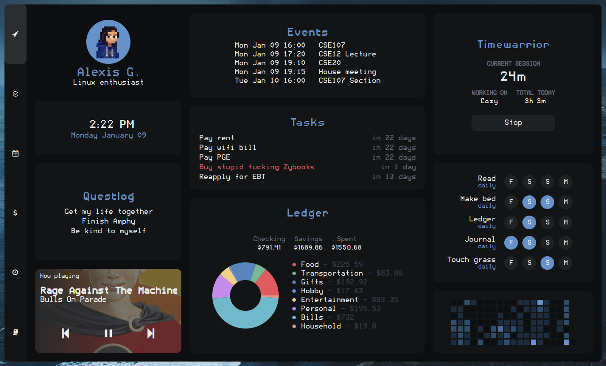

# cozy

  

Hi! This is **cozy**, my [AwesomeWM](https://awesomewm.org/) config. Thanks for checking it out!

The primary goal of this setup is to create an environment that:

1. can be used easily on both my laptop and my touchscreen tablet
2. integrates all the cli tools I use to manage my life into a nice dashboard
3. looks awesome!

<h2>Dashboard</h2>

**Features**

- Fancy music player (thank you [rxhyn](https://github.com/rxyhn/yoru))
- Events widget (with Google Calendar) 
- Tasks widget (with [Taskwarrior](https://taskwarrior.org/))
- Pomodoro timer (with [Timewarrior](https://timewarrior.net/))
- Habit tracker (with [Pixela](https://pixe.la/))
- Fancy finances (with [Ledger](https://github.com/ledger/))
  - Monthly spending tracker
  - Current account balances
- (WIP) Different tabs to show even more information!

<h2>Install and configure</h2>

(expand)

<b>NOTE: This setup is incomplete, somewhat buggy, and under constant development.</b> Because of that, I don't recommend daily driving it quite yet.

### Installation (Arch/Arch-based)

Install dependencies

`yay -S awesome-git gcalcli nerd-fonts-roboto-mono ttf-roboto picom-pijulius-git`

`pacman -S playerctl rofi scrot pamixer brightnessctl upower task timew ledger`

Clone repository

- `git clone --recurse-submodules https://github.com/garado/cozy.git`

(Optional) Make a backup of your old configs

- `cp -r ~/.config/awesome/ ~/.config/awesome.${USER}/`
- `cp -r ~/.config/rofi/ ~/.config/rofi.${USER}/`
- `cp ~/.config/picom.conf ~/.config/picom.${USER}.conf`

Copy configs

- `cd cozy && cp -r awesome/ rofi/ picom.conf ~/.config/`

Copy `misc/on-add-update-dash` and `misc/on-modify-update-dash` to your Taskwarrior hooks folder (default location is `~/.task/hooks`). This updates the task widget whenever Taskwarrior tasks are added/modified.

- `cp misc/on-add-update-dash misc/on-modify-update-dash ~/.task/hooks/`

Other theme stuff

| Name          | Source                                                               |
| ------------- | -------------------------------------------------------------------- |
| Cursors       | [Nordzy cursors](https://github.com/alvatip/nordzy-cursors)          |
| GTK theme     | [Nordic](https://github.com/EliverLara/Nordic)                       |
| Firefox theme | [Nordic](https://github.com/eliverlara/firefox-nordic-theme)         |
| Icon theme    | [Papirus-Nord](https://github.com/Adapta-Projects/Papirus-Nord)      |
| Vim theme     | [nord-vim](https://github.com/arcticicestudio/nord-vim)              |

## Configuration

Most configuration happens in `awesome/configuration/*` and `awesome/user_variables.lua`.

Make sure you update `configuration/apps.lua` with your default terminal/file manager/browser applications.

**Google Calendar events**

- Follow instructions to [set up gcalcli](https://github.com/insanum/gcalcli#login-information)
- The calendar widget checks `~/.cache/awesome/calendar/agenda` for data (in tsv format). It will automatically fetch data if it detects that there is no data in the file.
- To keep your widget updated, periodically update the cache by putting `gcalcli agenda --tsv > ~/.cache/awesome/calendar/agenda` in a cron job.

**Pixela habit tracker**

- [Read these instructions](https://pixe.la/) to create a Pixela account and create your habits
- Install [pi](https://github.com/a-know/pi) (command line Pixela tool)
  - The install instructions on pi's Github page don't work, follow this:
  - `go install github.com/a-know/pi/cmd/pi@latest`
  - Put `pi` (located in `$HOME/go/bin`) in your path
- Set the `PIXELA_USER_NAME` and `PIXELA_USER_TOKEN` environment variables
- Update `user_variables.lua` with the habits you want to display
- The `utils/dash/habits/cache_habits` script caches data from Pixela. Run it periodically with a cron job to keep your widget updated.

**Finances tracker**

- Update `user_variables.lua` with the ledger file to read from 

<h2>Known bugs</h2>

(expand)

- [ ] Pomodoro gets a little wonky if you restart awesome too many times
  - reason: stuff stored in xrdb to preserve pomodoro state across awesome restarts doesn't always get cleared properly
- [ ] Monthly spending arc chart animation doesn't always work
  - reason: i have no idea
- [ ] Task due dates don't always show correctly
  - reason: something weird with lua/taskwarrior timezones, i think

<h2>In progress/planned features</h2>

(expand)

- <b>Dashboard tabs</b>
  - Finances
    - [x] Recent transactions
    - [x] Monthly spending
    - [ ] Budget tracking 
    - [X] Arc chart animations :)
      - [x] base implementation
      - [X] fix bugs
    - [ ] Yearly account balance trends 
    - [ ] Redesign UI
  - Habits/goals
    - [ ] Goals tracker
    - [x] Habit tracker
  - Tasks/calendar
    - [ ] Fancier task displays
      - [ ] Support subtasks + progress bar
    - [ ] Calendar
  - [ ] Indicator for current dashboard tab
- **Control center**
  - [ ] Quick actions
  - [ ] Power menu
  - [ ] Volume/brightness control
- **Bar**
  - [x] Volume/brightness control
  - [ ] Variable bar orientation!
  - [ ] Systray
  - [ ] Better app launcher
- **Other**
  - [ ] Theme switcher
  - [ ] Custom rofi launcher
- **Notifications**
  - [ ] Add icons

## Credits

- [rxhyn](https://github.com/rxyhn/yoru) for code reference
- [adi1090x]() for rofi theme
- [siddhanthrathod](https://github.com/siddhanthrathod/bspwm) for picom configuration
