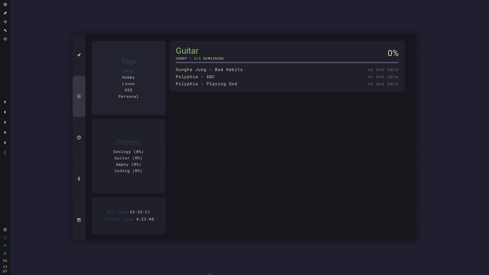
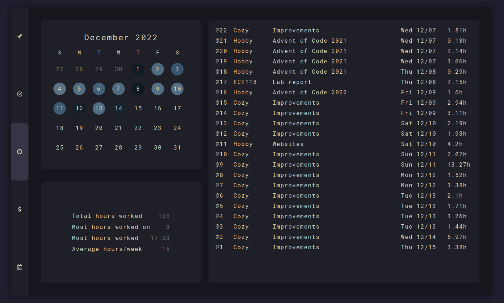

<h1 align="center">cozy</h1>

  

Hi! This is <b>cozy</b>, my Arch config with <a href="https://awesomewm.org" target="_blank">AwesomeWM</a>. Thanks for checking it out!

  The primary goals of this setup are to create an environment that:

<ol>
<li>can be used easily on both my laptop and my touchscreen tablet</li>
<li>integrates all the cli tools I use to manage my life into a nice dashboard</li>
<li>looks awesome!</li>
</ol>

<h2>⚠️ This project is undergoing heavy refactoring. It probably won't work on your machine. It's best used as just a reference for now.</h2>

Support is limited to nonexistent as I'm busy with school.

<h2>🚀 Features</h2>
<h3>Dashboard</h3>

  

<ul>
<li><b>Fully keyboard navigable!</b></li>
<li>Fancy music player (thank you <a href="https://github.com/rxyhn/yoru" target="_blank">rxhyn</a>)</li>
<li>Calendar (with Google Calendar) </li>
<li>To do list (with <a href="https://taskwarrior.org/" target="_blank">Taskwarrior</a>)</li>
<li>Time tracking (with <a href="https://timewarrior.net" target="_blank">Timewarrior</a>)</li>
<li>Interactive habit tracker (with <a href="https://pixe.la" target="_blank">Pixela</a>)</li>
<li>Fancy finances (with <a href="https://github.com/ledger/" target="_blank">Ledger</a>)</li>
<li>(WIP) Different tabs to show even more information!</li>
</ul>

<h4>To do list applet (Taskwarrior)</h4>

  

<ul>
  <li>View tags, projects, and project stats</li>
  <li>Easily add and modify tasks</li>
  <li>Supports starting and stopping tasks for easy time-tracking</li>
</ul>

<h4>Finances at a glance</h4>

  

<ul>
  <li>Uses Ledger as a backend - have the convenience of a banking app without relying on a shady 3rd party</li>
  <li>Quickly access ledger files to add or update ledger entries</li>
</ul>

<h4>Time tracking</h4>

  

<ul>
  <li>Heatmap showing which days you've worked the hardest</li>
  <li>View time tracking statistics and recent sessions</li>
</ul>

<h3>Control center</h3>

  

Also fully keyboard navigable!

<h3>Theme switcher</h3>

  

The theme switcher can set the theme for your entire system - not just Awesome. By default, it switches Kitty and NvChad themes, but it is easily extensible to whichever applications you use.

Built-in themes:

| Theme name | Styles       |
|------------|--------------|
| nord       | dark, light  |
| dracula    | dark         |
| tokyonight | dark         |
| gruvbox    | dark, light  |
| catpuccin  | mocha, latte |

<ul>
  <li>
    

<b>nord</b>

      

        
      

      

        
      

    

  </li>
  <li>
    

<b>dracula</b>

      

        
      

    

  </li>
  <li>
    

<b>catpuccin</b>

      

        
      

    

  </li>
  <li>
    

<b>tokyo_night</b>

      

        
      

    

  </li>
  <li>
    

<b>gruvbox</b>

      

        
      

      

        
      

    

  </li>
</ul>

<h3>Install and configure</h3>
See the <a href="https://github.com/garado/cozy/wiki" target="_blank">wiki</a> for complete install instructions.

<h3>Other stuff</h3>
<b>Why is it called 'cozy'?</b> 

I've spent a lot of time tweaking this setup to be just the way I like it, so now this setup feels very personal, comfortable, and <b>cozy</b>.  :-)

<h3>Credits</h3>
<ul>
<li><a href="https://github.com/rxyhn/yoru" target="_blank">rxyhn</a> for code reference
<li><a href="https://github.com/adi1090x/rofi" target="_blank">adi1090x</a> for rofi theme
<li><a href="https://github.com/siddhanthrathod/bspwm" target="_blank">siddhanthrathod</a> for picom configuration
<li><a href="https://github.com/nickclyde/rofi-bluetooth" target="_blank">nick clyde</a> for rofi-bluetooth
</ul>
