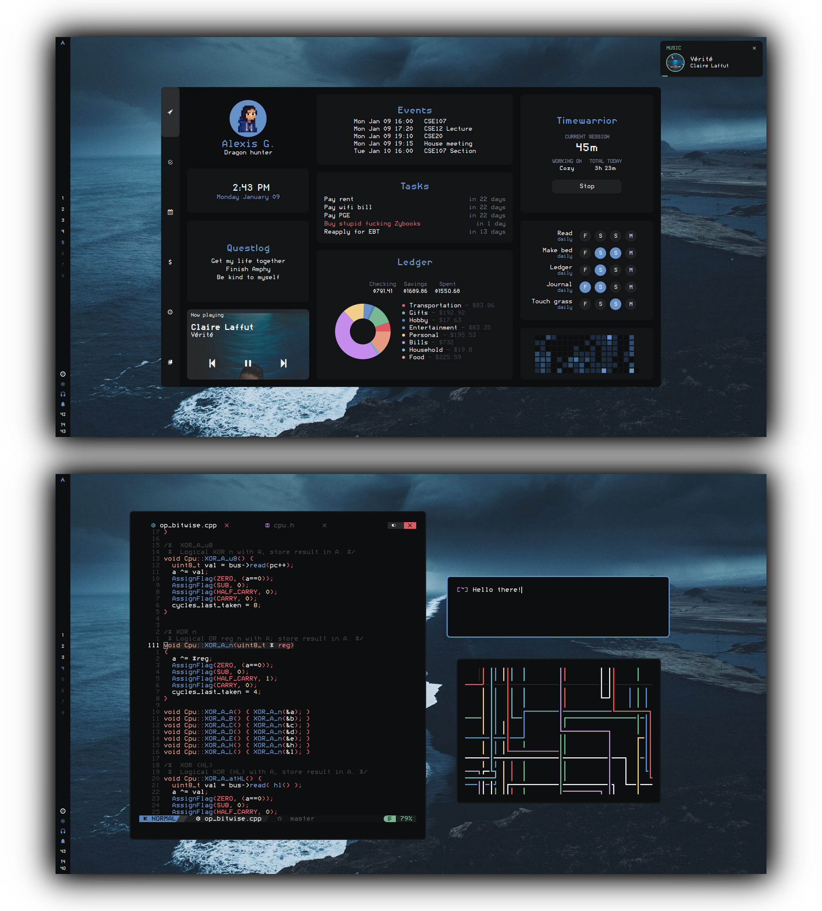

# awesome

Hi! This is my [AwesomeWM](https://awesomewm.org/) config. Thanks for checking it out!

The primary goal of this setup is to create an environment that:
  1. can be used easily on both my laptop and my touchscreen tablet
  2. integrates all the cli tools I use to manage my life into a nice dashboard
  3. looks awesome!

**NOTE: This setup is incomplete, somewhat buggy, and under constant development.** Because of that, I don't recommend daily driving it quite yet.

# Installation (Arch/Arch-based)
## Clone
`cd ~/.config/ && git clone --recurse-submodules https://github.com/garado/awesome_dotfiles.git awesome`

Update `configuration/apps.lua` with your default terminal/file manager/browser applications.

## Install dependencies
`yay -S awesome-git gcalcli nerd-fonts-roboto-mono ttf-roboto picom-pijulius-git`

`pacman -S playerctl rofi scrot pamixer brightnessctl upower task timew ledger`

## Configuration
**Google Calendar events**
- Follow instructions to [set up gcalcli](https://github.com/insanum/gcalcli#login-information)
- The calendar widget checks `~/.cache/awesome/calendar/agenda` for data (in tsv format). It will automatically fetch data if it detects that there is no data in the file.
- To keep your widget updated, periodically update the cache by putting `gcalcli agenda --tsv > ~/.cache/awesome/calendar/agenda` in a cron job.

**Pixela habit tracker**
- [Read these instructions](https://pixe.la/) to create a Pixela account and create your habits
- Install [pi](https://github.com/a-know/pi) (command line Pixela tool)
  - The install instructions on pi's Github page don't work, follow this:
  - `go install github.com/a-know/pi/cmd/pi@latest`
  - Put `pi` (located in `$HOME/go/bin`) in your path
- Set the `PIXELA_USER_NAME` and `PIXELA_USER_TOKEN` environment variables
- Update `user_variables.lua` with the habits you want to display
- The `utils/dash/habits/cache_habits` script caches data from Pixela. Run it periodically with a cron job to keep your widget updated.

**Finances tracker**
- Update `user_variables.lua` with the ledger file to read from 

## Other stuff
| Name          | Source                                                                 |
| ----          | ----                                                                   |
| Cursors       | [Nordzy cursors](https://github.com/alvatip/nordzy-cursors)            |
| GTK theme     | [Nordic](https://github.com/EliverLara/Nordic)                         |
| Firefox theme | [Nordic](https://github.com/eliverlara/firefox-nordic-theme)           |
| Icon theme    | [Papirus-Nord](https://github.com/Adapta-Projects/Papirus-Nord)        |
| Vim theme     | [nord-vim](https://github.com/arcticicestudio/nord-vim)                |
| Rofi          | custom version of [adi1090x theme](https://github.com/adi1090x/rofi) |

# Dashboard

**Features**
- Fancy music player (thank you [rxhyn](https://github.com/rxyhn/yoru))
- Events widget (with Google Calendar) 
- Tasks widget (with [Taskwarrior](https://taskwarrior.org/))
- Pomodoro timer (with [Timewarrior](https://timewarrior.net/))
- Habit tracker (with [Pixela](https://pixe.la/))
- Fancy finances (with [Ledger](https://github.com/ledger/))
  - Monthly spending tracker
  - Current account balances

## Dashboard tabs
I couldn't fit enough information onto the main dashboard page, so I'm adding tabs!

**Dashboard tab progress**
- Finances
  - [X] Recent transactions
  - [X] Monthly spending
  - [ ] Budget tracking 
  - [ ] Arc chart animations :)
  - [ ] Yearly account balance trends 
  - [ ] Redesign UI
- Habits/goals
  - [ ] Goals tracker
  - [X] Habit tracker
- Tasks/calendar
  - [ ] Fancier task displays
    - [ ] Support subtasks + progress bar
  - [ ] Calendar

# In progress/planned
- **Dash (other)**
  - [ ] Indicator for current dash tab
- **Control center**
  - [ ] Quick actions
  - [ ] Power menu
  - [ ] Volume/brightness control
- **Bar**
  - [X] Volume/brightness control
  - [ ] Variable bar orientation!
  - [ ] Systray
  - [ ] Better app launcher
- **Other**
  - [ ] Theme switcher
  - [ ] Custom rofi launcher
- **Notifications**
  - [ ] Add icons

# Credits
- [rxhyn](https://github.com/rxyhn/yoru) for code reference 
